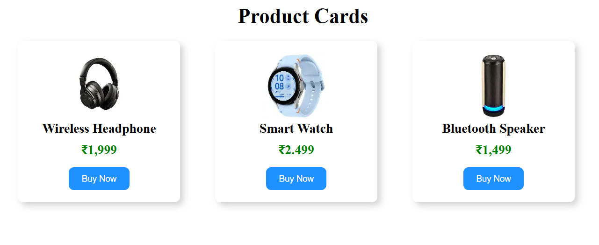

# 🛍️ Product Cards

A modern and responsive Product Cards webpage built using **HTML5** and **CSS3**. This project displays multiple products in an attractive card layout with product images, names, prices, and a "Buy Now" button.

## ✨ Features

- Responsive card layout
- Clean and modern user interface
- Multiple product cards
- Product images
- Product names and prices
- Stylish "Buy Now" buttons
- CSS Hover Effects
- Beginner-friendly project

## 🛠️ Tech Stack

- HTML5
- CSS3

## 📁 Project Structure

```
Product-Cards/
│── product.html
│── product.css
│── image/
│   ├── headphone.png
│   ├── smartwatch.png
│   └── speaker.png
│── README.md
```

## 📷 Project Preview



## 🎯 Learning Outcomes

- HTML page structure
- CSS Flexbox
- Card layout design
- Image styling
- Button styling
- Box Shadow
- Border Radius
- Responsive Design

## 🚀 How to Run

1. Clone or download this repository.
2. Open the project folder.
3. Open `index.html` in your browser.

## 👩‍💻 Author

**Pavatharani S**

