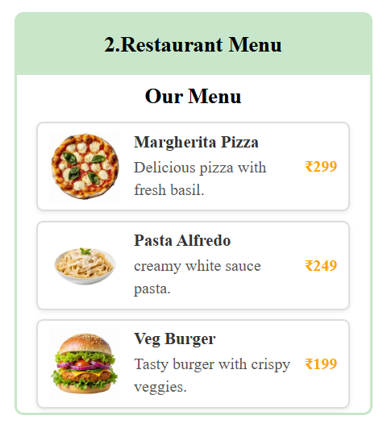

# 🍽️ Restaurant Menu

A simple and responsive Restaurant Menu webpage created using HTML and CSS. This project displays food items with images, descriptions, and prices in an attractive card layout.

## 📌 Features

- Responsive restaurant menu design
- Clean and modern user interface
- Food images with descriptions
- Attractive price section
- Card-based layout with CSS styling
- Beginner-friendly project

## 🛠️ Tech Stack

- HTML5
- CSS3

## 📂 Project Structure

```
Restaurant-Menu/
│── restraunt.html
│── restraunt.css
│── images
│── README.md
```

## 📷 Project Preview

> Add your screenshot here after uploading it to your project.

```md

```

## 🎯 Learning Outcomes

- HTML page structure
- CSS Flexbox
- Card design
- Image styling
- Box Shadow
- Responsive layouts

## 🚀 How to Run

1. Download or clone the repository.
2. Open the project folder.
3. Double-click `restraunt.html` or open it in your browser.

## 📄 License

This project is created for learning and practice purposes.

## 👩‍💻 Author

**Pavatharani S**
