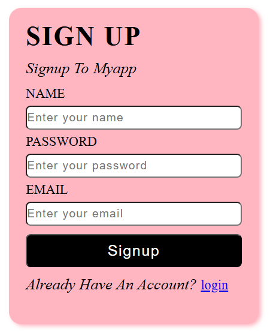

# 📝 Simple Signup Form

A clean and modern **Signup Form** built using **HTML5** and **CSS3**. This project provides a simple user registration interface with input fields for Name, Password, and Email, along with a Signup button and a Login link for existing users.

---

## 📌 Features

- Clean and minimal user interface
- User registration form
- Name, Password, and Email input fields
- Stylish Signup button
- Login link for existing users
- Responsive card layout
- Beginner-friendly HTML & CSS project

---

## 🛠️ Tech Stack

- HTML5
- CSS3

---

## 📁 Project Structure

```
SimpleSignupForm/
│── loginform.html
│── loginform.css
│── signup.png
│── README.md
```

---

## 📷 Project Preview



## 🎯 Learning Outcomes

- HTML Forms
- Input Elements
- CSS Box Model
- Border Radius
- Typography Styling
- Button Design
- Flexbox (if used)
- Form Layout and Alignment

---

## 🚀 How to Run

1. Clone or download this repository.
2. Open the project folder.
3. Open `signup.html` in your browser.

---

## 🔮 Future Enhancements

- Add JavaScript form validation
- Password visibility toggle
- Mobile responsive design
- Connect the form with a backend
- Display success and error messages

---

## 👩‍💻 Author

**Pavatharani S**

GitHub: https://github.com/pavatharanis

---

⭐ If you found this project helpful, consider giving it a **Star** on GitHub!